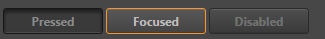
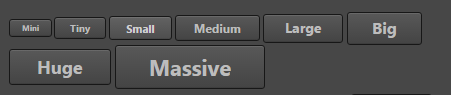
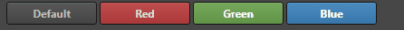
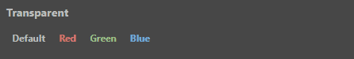
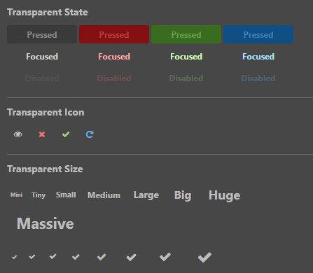

# ui-button 参考

## 基础用法

```
<ui-button>buttton</ui-button>
```

## 属性
属性  | 参数值类型 | 功能说明
------|--------------|-------------
[pressed](#pressed,-focused,-disabled-控制-button-状态) | boolean | 控制按钮 pressed 状态  
[focused](#pressed,-focused,-disabled-控制-button-状态)| boolean  | 控制按钮 focused 状态 
[disabled](#pressed,-focused,-disabled-控制-button-状态)| boolean  | 控制按钮 disabled 状态, 设置此属性后不再响应事件
[unnavigable](#pressed,-focused,-disabled-控制-button-状态)| boolean  | 控制按钮是否可导航, 按钮默认可以通过 tab 键获取焦点, 设置此属性后不再响应 tab, 并且鼠标获取焦点后不会有 focus 样式

## 样式控制
种类  | 参数值类型 | 功能说明
------|-----------|-------------
[size](#控制按钮-size-样式) |class样式名, string, 支持值"mini, tiny, samll, medium, large, big, huge, massive" | 控制按钮大小  
[color](#控制按钮-color-样式) |class样式名, string, 支持值"red, green, blue" | 控制按钮颜色  
[transparent](#透明按钮) |class样式名, string, 支持值"transparent" | 控制按钮种类是否为透明类型 

## event 事件
事件名称|是否冒泡|触发机制
-------|-------|--------
click|是|点击按钮触发
confirm|是|点击按钮触发

### 示例
```
let $button = document.getelementByTag('ui-button);
$button.addEventListener('confirm', (event) => {
    consol.log('confirm);
})
$button.addEventListener('click', (event) => {
    consol.log('click);
})
```
此代码，点击按钮后将触发 confirm 与 click 事件

## 使用效果示例
以下仅列举基础例子, 更多效果可参见编辑器内的 UI-Kit Preview 面板
### pressed, focused, disabled 控制 button 状态
代码示例
```
<ui-button pressed>pressed</ui-button>
<ui-button focused>focused</ui-button>
<ui-button disabled>disabled</ui-button>
```
> 注意：布尔属性，只要赋值为真值即存在该属性，想要赋值 false 时，注意传递的值是否因转化为字符串而导致其他结果           

效果图：         


### 控制按钮 size 样式
代码示例
```
<ui-button class="mini">Mini</ui-button>
<ui-button class="tiny">Tiny</ui-button>
<ui-button class="small">Small</ui-button>
<ui-button class="medium">Medium</ui-button>
<ui-button class="large">Large</ui-button>
<ui-button class="big">Big</ui-button>
<ui-button class="huge">Huge</ui-button>
<ui-button class="massive">Massive</ui-button>
```
效果图      


### 控制按钮 color 样式
代码示例
```
<ui-button style="width: 100px;">Default</ui-button>
<ui-button style="width: 100px;" class="red">Red</ui-button>
<ui-button style="width: 100px;" class="green">Green</ui-button>
<ui-button style="width: 100px;" class="blue">Blue</ui-button>
```
效果图    


### 透明按钮
代码示例
```
<ui-button class="transparent">Default</ui-button>
<ui-button class="red transparent">Red</ui-button>
<ui-button class="green transparent">Green</ui-button>
<ui-button class="blue transparent">Blue</ui-button>
```
效果图   


### 综合样式效果

