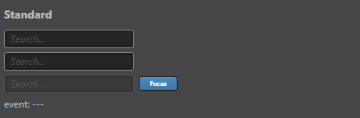
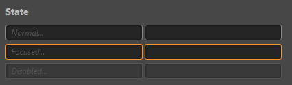
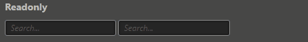
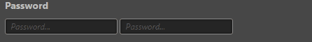
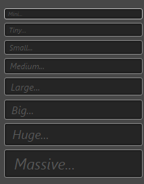

# ui-input 参考

## 基础用法

```
<ui-input placeholder="Search..." tabindex="-1"></ui-input>
```
效果图    


## 属性
属性  | 参数值类型 | 功能说明
------|--------------|-------------  
[focused](#pressed,-focused,-disabled-控制状态)| boolean | 控制focused 状态 
[disabled](#pressed,-focused,-disabled-控制状态)| boolean | 控制disabled 状态, 设置此属性后不再响应事件
[readonly](#readonly)| boolean | 控制readonly 状态, 设置此属性后不再响应事件
[password](#设置-password)| boolean | 控制是否为 password 类型, 设置此属性后输入值显示为 "."
unnavigable| boolean | 控制是否可导航, 按钮默认可以通过 tab 键获取焦点, 设置此属性后无法通过 tab 获取焦点，并且鼠标获取焦点后不会有 focus 样式
placeholder| string | input 不存在 value 值时显示的内容

## 样式控制
种类              | 参数值类型 | 功能说明
----------------|-----------|-------------
[size](#size-控制大小)      |class样式名, string, 支持值"mini, tiny, samll, medium, large, big, huge, massive" | 控制按钮大小 

## event 事件
事件名称|是否冒泡|触发机制
-------|-------|--------
change|是|input 进行输入改变值时或因 cancel 改值
confirm|是|发生 change 改值后，失去焦点或键入 enter
cancel|是|发生 change 改值后，键入 esc （此时将恢复原值）

## 使用效果示例

### pressed, focused, disabled 控制状态
```
<ui-input placeholder="Normal..."></ui-input>
<ui-input placeholder="Focused..." focused></ui-input>
<ui-input placeholder="Disabled..." disabled></ui-input>
```
效果图    


### readonly
```
<ui-input placeholder="Readonly..." readonly></ui-input>
```
效果图   


### 设置 password
```
<ui-input placeholder="Password..." password></ui-input>
```
效果图   

> 注意 readonly 为全小写

### size 控制大小
```
<ui-input class="mini"></ui-input>
<ui-input class="tiny"></ui-input>
 ····
```
