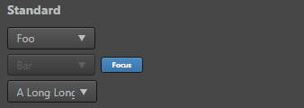
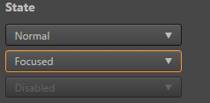
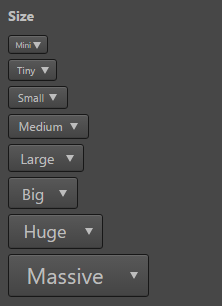

# ui-select 参考

## 基础用法

```html
<ui-select value="4">
    <option value="0">Foo</option>
    <option value="1">Bar</option>
    <option value="2">Hello</option>
    <option value="3">World</option>
    <option value="4">A Long Text</option>
</ui-select>
```


## 属性
属性名  | 参数值类型 | 功能说明
------|--------------|-------------  
`value`| string| 当前选中的 `option` 的 `value` 值
[`focused`](#focused,-disabled`-控制状态)| boolean | 控制 `focused` 状态 
[`disabled`](#focused,-disabled`-控制状态)| boolean | 控制 `disabled` 状态, 设置此属性后不再响应事件
`readonly`| boolean | 控制 `readonly` 状态, 设置此属性后不再响应事件
`unnavigable`| boolean | 控制是否可导航, 组件默认可以通过 tab 键获取焦点, 设置此属性后无法通过 tab 获取焦点，并且鼠标获取焦点后不会有 focus 样式

## 样式控制
种类              | 参数值类型 | 功能说明
----------------|-----------|-------------
[size](#size-控制大小)      | `class` 样式名, string, 支持值"**mini, tiny, samll, medium, large, big, huge, massive**" | 控制按钮大小 

## event 事件
事件名称|是否冒泡|触发机制
-------|-------|--------
`change` |是|组件选择其他选项引起 `value` 值发生改变时
`confirm` |是|组件选择其他选项引起 `value` 值发生改变时

## 使用效果示例

### `focused, disabled` 控制状态
```html
<ui-select value="0">
    <option value="0">Normal</option>
</ui-select>
<ui-select value="0" focused>
    <option value="0">Focused</option>
</ui-select>
<ui-select value="0" disabled>
    <option value="0">Disabled</option>
</ui-select>
```


### size 控制大小
```html
<ui-select class="mini" value="0">
    <option value="0">Foo</option>
</ui-select>
<ui-select class="tiny" value="0">
    <option value="0">Foo</option>
</ui-select>
 ····
```
